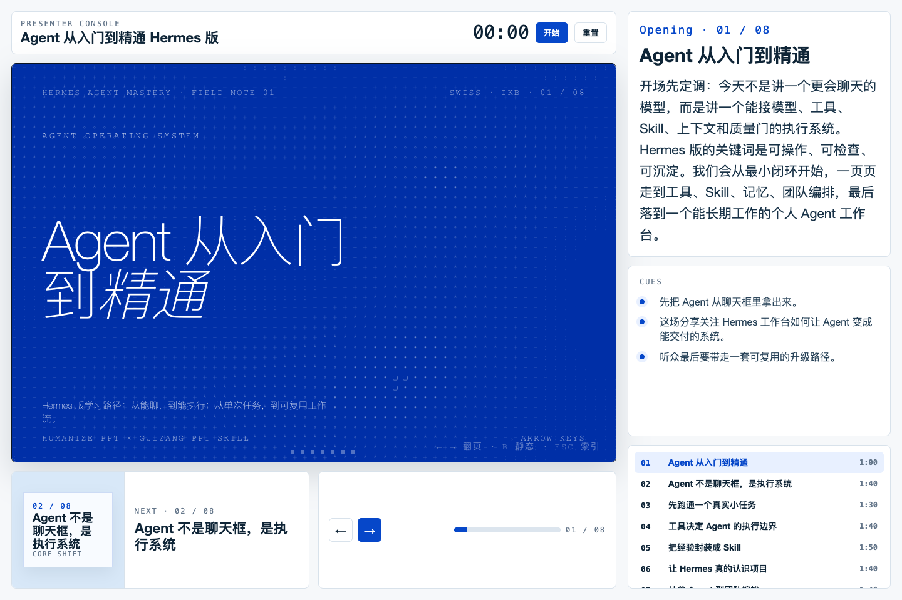

<div align="center">

# Humanize PPT

## Presentation workflow director for agents

**Turn raw material into a human-centered production contract, then hand it to downstream PPT skills for style exploration, slide rendering, presenter mode, and deployment.**

[GitHub Pages](https://learnprompt.github.io/humanize-ppt/) · [Release](https://github.com/LearnPrompt/humanize-ppt/releases) · [MIT License](LICENSE)

[Live Preview](https://learnprompt.github.io/humanize-ppt/) · [中文](README.md) · [AST Theory](docs/AST-theory.md) · [OPC Workflow](docs/OPC-workflow.md) · [Agent Teams](docs/agent-teams.md)

</div>

---

## Showcase

Humanize PPT does not try to be a template library. It turns source material into a clear AST contract, then routes production to the right PPT skill. The current stable showcases cover the Chinese guizang path and the English Neo-Grid path.

| Chinese guizang path | English Neo-Grid path |
| --- | --- |
| [](https://learnprompt.github.io/humanize-ppt/showcase/hermes-agent-mastery/presenter/) | [](https://learnprompt.github.io/humanize-ppt/showcase/hermes-agent-mastery/en/presenter/) |
| Open the [Chinese presenter](https://learnprompt.github.io/humanize-ppt/showcase/hermes-agent-mastery/presenter/) or [Chinese deck](https://learnprompt.github.io/humanize-ppt/showcase/hermes-agent-mastery/ppt/) | Open the [English presenter](https://learnprompt.github.io/humanize-ppt/showcase/hermes-agent-mastery/en/presenter/) or [English deck](https://learnprompt.github.io/humanize-ppt/showcase/hermes-agent-mastery/en/ppt/) |

You can also view the published [Skill sharing deck](https://learnprompt.github.io/humanize-ppt/showcase/skill-share/).

## 30-second start: ask your agent to install and use it

If you use Codex, Claude Code, Hermes, or another Skill-aware agent, send it this:

```text
Please install and use the Humanize PPT Skill:
https://github.com/LearnPrompt/humanize-ppt

I want to create a presentation. First use Humanize PPT to turn my material
into an AST production contract, then choose the downstream PPT skill based on
language and delivery context.
For Chinese content, prefer the stable guizang path.
For English content, show me at least 5 style candidates before making the full deck.
After I approve the deck, add presenter / export / QA and report the output paths.
```

If your agent needs an explicit install command, ask it to run:

```bash
npx skills add https://github.com/LearnPrompt/humanize-ppt.git -g -y
```

## How to talk to the agent

You do not need to start with CLI flags. The natural interaction is staged:

```text
I have material about "AI tool updates". Use Humanize PPT to create the PPT outline
and style preview first. The audience is a product team. The point is not a feature
list; I want them to understand how these tools change the workflow.
```

```text
I choose the second style. Continue into the full deck and add presenter mode.
If the deck needs materials, tell me which slides should use GPT images, SVG diagrams,
or Remotion clips before producing them.
```

```text
Run QA: check repeated titles, clipped text in materials, empty slides, and video playback.
List the issues, fix what you can, then give me the local paths and deployable paths.
```

## CLI reproduction

If you want to bypass the agent and reproduce the path locally, run:

```bash
python3 scripts/humanize_ppt.py \
  --source examples/01-ai-tool-update/source.md \
  --out .humanize-ppt-runs/ai-tool-update-preview \
  --title "AI 工具更新，不只是功能清单" \
  --style-mode preview-first
```

Open the result:

```bash
open .humanize-ppt-runs/ai-tool-update-preview/outputs/beautiful/previews/index.html
open .humanize-ppt-runs/ai-tool-update-preview/outputs/qa/qa_report.md
```

After selecting a Beautiful template, generate the full deck and optional presenter/export adapters:

```bash
python3 scripts/humanize_ppt.py \
  --source examples/01-ai-tool-update/source.md \
  --out .humanize-ppt-runs/ai-tool-update-complete \
  --title "AI 工具更新，不只是功能清单" \
  --selected-template <slug> \
  --presenter-adapter \
  --export-adapter
```

Legacy `scripts/humanize_ppt_v1.py` through `scripts/humanize_ppt_v5.py` remain available for compatibility and historical reproduction. README examples only recommend `scripts/humanize_ppt.py`.

## What it does

- **Creates an AST contract**: audience, state transfer, slide intent, and speaking rhythm.
- **Routes downstream skills**: guizang, Beautiful templates, presenter/export adapters, and QA.
- **Previews before final render**: English decks show at least five visible style candidates before the selected full deck.
- **Completes the delivery loop**: presenter mode, export package, QA report, and static deploy path.

## Good fit / Not a fit

Good fit:

- You have source material, a topic, or a rough outline, but need a presentable and renderable PPT production contract.
- You want Chinese decks to default to the stable guizang production path.
- You want English decks to explore multiple visual directions before final rendering.
- You want Agent Teams to produce the deck instead of manually moving content into templates.

Not a fit:

- You only need a one-off template library.
- You expect it to replace every HTML PPT, Remotion, or image-generation skill.
- You do not yet know the audience, topic, or delivery setting.

## Workflow paths

The Chinese default path is now fixed as: `Humanize PPT → guizang → material QA → presenter → static deploy`. For Chinese content without an explicit style-exploration request, guizang is the stable rendering path; presenter mode and deploy come after the deck is approved.

The English default path is now fixed as: `Humanize PPT → theme brief → 5-style gallery → selected style full deck → presenter/deploy`. English decks should not jump straight into one final visual system; they first show at least five visible style candidates, then continue only after a style is selected.

The current focus is a stable material → AST contract → preview/full deck → presenter/export → QA workflow. Broader renderer automation, video generation, deployment integrations, and team-package uploading are deferred.

## Why AST

Humanize PPT uses AST theory:

- **Audience**: who is listening, what they know, and what they resist;
- **State**: where the audience starts and where the deck should move them;
- **Transfer**: how each slide moves the audience forward.

Core idea:

> PPT is not an information container. PPT is an audience state-transfer artifact.

## No-dependency smoke check

If pytest is unavailable, run the stdlib-only smoke check:

```bash
python3 scripts/smoke_check.py
```

It runs the stable entrypoint through a minimal path that does not require an external template library, then checks for:

```text
deck_brief.md
ast_outline.md
slide_plan.json
router_plan.json
run_manifest.json
outputs/qa/qa_report.md
```

See [docs/smoke-test.md](docs/smoke-test.md).

## Output shape

A run produces:

```text
out/
  deck_brief.md
  ast_outline.md
  slide_plan.json
  speaker_intent.md
  asset_manifest.md
  video_slots.json
  style_brief.md
  renderer_registry.json
  router_plan.json
  run_manifest.json
  commands/
    *.md
  outputs/
    beautiful/
    guizang/
    presenter/
    export/
    qa/
```

Some renderer-specific folders may be empty or marked pending depending on the selected route.

## Current boundaries

- Recommended entrypoint: `scripts/humanize_ppt.py`
- Compatibility entrypoints: `scripts/humanize_ppt_v1.py` through `scripts/humanize_ppt_v5.py`
- Historical version notes: `docs/versions/`
- Plans and reviews: `docs/plans/`
- Safe sample inputs: `examples/`

## Reference

Humanize PPT is shaped by these projects and operating rules:

- [op7418/guizang-ppt-skill](https://github.com/op7418/guizang-ppt-skill): stable Chinese deck production, Swiss visual constraints, and material QA.
- [zarazhangrui/beautiful-html-templates](https://github.com/zarazhangrui/beautiful-html-templates): English multi-style candidates and selected-template full deck production.
- [zarazhangrui/frontend-slides](https://github.com/zarazhangrui/frontend-slides): English slide workflow, viewport-safe HTML decks, PPTX, and publishing direction.
- [huggingface/smolagents](https://github.com/huggingface/smolagents): a code-first agent workflow reference for the "read contract, run tools, write back results" collaboration pattern.
- [AST Theory](docs/AST-theory.md), [OPC Workflow](docs/OPC-workflow.md), and [Agent Teams](docs/agent-teams.md): Humanize PPT's own production contract, routing model, and multi-agent division of labor.
- [Guizang material QA](references/guizang-material-qa.md), [Guizang presenter deploy](references/guizang-presenter-deploy.md), and [English Style Gallery](docs/versions/v0.6.3-english-style-gallery.md): current operating rules for the stable Chinese and English paths.

## License

MIT
