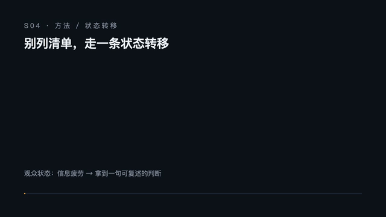

<sub>🌐 <a href="README.md">中文</a> · <b>English</b></sub>

<div align="center">

# Humanize PPT

> *A template library can spread one concept across a dozen pretty HTML pages. What you have to stand up and deliver is the line that pushes the audience forward, one page at a time.*

[](SKILL.md)
[](https://skills.sh/LearnPrompt/humanize-ppt)
[](https://github.com/LearnPrompt/humanize-ppt/releases)
[](LICENSE)

**A presentation system, born for the talk.** Good-looking HTML templates are everywhere; what's missing is the line that lets you *deliver* one. Humanize does the part templates don't: it uses AST (audience-state-transfer) to weave your material into that line, so every page turn moves the audience forward; the pages that need a picture get a real image, SVG diagram, or Remotion clip; and after rendering it runs its own presentation checkup to pull out the pages you can only look at, not present. What ships isn't a stack of static pages — it's a presenter mode with a speaker script, its state transitions, and the HTML beauty intact. The full deck is still rendered natively by a downstream template skill: it paints each page, Humanize makes it deliverable on stage.

[Install in 30s](#install-in-30s) · [Use it in one line](#use-it-in-one-line) · [See it](#see-it) · [What it solves](#what-it-solves) · [Presentation checkup](#presentation-checkup) · [Visual enhancement](#visual-enhancement) · [English path](#english-path) · [AST](docs/AST-theory.md)

</div>

---

## Install in 30s

Have your agent (Codex / Claude Code / Hermes …) install Humanize PPT — simplest is to hand it the GitHub link:

```text
Please install the Humanize PPT Skill: https://github.com/LearnPrompt/humanize-ppt
```

Or one line of npx:

```bash
npx skills add LearnPrompt/humanize-ppt -g
```

Claude Code users can use the plugin marketplace (auto-updates):

```text
/plugin marketplace add LearnPrompt/humanize-ppt
/plugin install humanize-ppt
```

**To run the whole flow, install this set of downstream skills too** (Humanize writes the outline and decisions; they render and produce assets):

| Skill | Role | Source |
|---|---|---|
| `guizang-ppt-skill` | Chinese deck native render (magazine / Swiss) | [op7418/guizang-ppt-skill](https://github.com/op7418/guizang-ppt-skill) |
| `frontend-slides` | English deck native render (viewport-safe HTML) | [zarazhangrui/frontend-slides](https://github.com/zarazhangrui/frontend-slides) |
| `beautiful-html-templates` | English deck multi-template render | [zarazhangrui/beautiful-html-templates](https://github.com/zarazhangrui/beautiful-html-templates) |
| `remotion-video-toolkit` | Per-page explainer video (real mp4) | Remotion |
| `baoyu-image-gen` | Images via the local Codex CLI (**no API key**) | [JimLiu/baoyu-skills](https://github.com/JimLiu/baoyu-skills/tree/main/skills/baoyu-image-gen) |

One line to the agent: "Install humanize-ppt and its recommended downstream skills (guizang-ppt-skill, frontend-slides, beautiful-html-templates, remotion-video-toolkit, baoyu-image-gen)."

## Use it in one line

Once installed, run the whole flow with one message — copy-paste it to your agent:

```text
Use humanize-ppt to turn this material into an English presentation deck: produce
the AST outline and per-page intent, render natively with frontend-slides (or
beautiful-html-templates), use baoyu-image-gen for images and remotion for video,
then run the presentation checkup and tell me which pages can't be presented, and
finish with presenter mode.
```

For Chinese, swap in "Chinese + guizang-ppt-skill". CLI flags, staged control, and re-injection commands live in [Advanced usage](#advanced-usage) below — beginners can skip them.

## See it

### Style gallery: downstream renders 4 covers before the outline, so you can pick

<p align="center">
  
  
  
  
</p>

<p align="center"><sub>
▲ Four covers of the same deck, rendered natively by guizang-ppt-skill — Ink Classic / Kraft Paper / Indigo Porcelain (Style A) + Swiss Klein Blue (Style B). Humanize emits the spec/command; covers are rendered downstream.
</sub></p>

### Visual enhancement: images and video are real output, and they move

<p align="center">
  
  
</p>

<p align="center"><sub>
▲ Left: hero image, generated by <code>baoyu-image-gen</code> via the local Codex CLI (gpt-image, no API key). Right: a per-page explainer, a real Remotion-rendered mp4 (shown as a GIF here so you can see it move). Per-slot log: <a href="docs/showcase/v0.9-visual-enhancement/media-production-2026-06-17.md">production record</a>.
</sub></p>

### Presentation checkup: auto-catch covered text

| Before: page badge eats the body text | After: every word is presentable |
|---|---|
|  |  |

<p align="center"><sub>
▲ Real case (2026-06-13 English deck): static scan passed, but the per-page screenshot review found a page-number badge covering body text on 9 pages — the audience would read "uires confirmation." Caught automatically, fix prompt emitted, re-check passed — no more hunting page numbers by hand with Codex. <a href="docs/showcase/hermes-agent-mastery/en/qa/presentation-checkup-2026-06-13.md">Round log</a> · <a href="https://learnprompt.github.io/humanize-ppt/">Browse the deck</a>
</sub></p>

## What it solves

I give a fair number of talks. Every time I reached for one of those gorgeous HTML PPT skills I hit the same wall: **they're built for concept display** — a single idea balloons into a dozen pages, but a 90-minute talk tops out around thirty. The pretty shell runs ahead of the content density; the pages look great and the line doesn't hold.

Humanize PPT fills that gap. It doesn't take over the template's "renders beautifully" job — it turns *beautiful* into *deliverable*:

1. **AST outline — every page turn teaches the audience something.** AST = Audience-State-Transfer. I fed an AI 70+ TED talks and had it distill how a talk carries an audience forward, page by page. Humanize weaves your material into that line: each turn should move the audience to understand a concept, not pile on information.
2. **Visual enhancement — the pages that need a picture get a real one.** Per page it decides image / SVG diagram / video and hands the plan to downstream: images via `baoyu-image-gen` (local Codex CLI, no key), video via Remotion, data figures as deterministic SVG. Both the Chinese (guizang) and English paths have image generation wired in.
3. **Automatic presentation checkup — stop hunting for the broken page.** Text covered by a badge used to mean a back-and-forth with Codex to find which page. Better to let the checkup scan it all at once after render and tell you which page, what's wrong, how to fix.
4. **Presenter mode — what ships is something you can take on stage.** Human feel, a speaker script, the state transition per page, and the HTML beauty kept intact.

The boundary is clear: **the full beautiful deck is rendered natively by the downstream template skill**; Humanize doesn't copy its template or touch the rendered HTML. Humanize directs the talk; the template paints each page.

## Presentation checkup

First, what a failed page is: one with only a few words that never finishes its point; or one that doesn't complete the audience state transfer it promised, so the listener leaves it in the same state they arrived. Such pages shouldn't exist. HTML's variety is seductive — it's easy to ship a deck where a page says nothing. That's made for looking at, not presenting.

The checkup grades the outline, not the beauty: it diffs each rendered page against its outline page. The failure-mode catalog is in [references/qa-failure-modes.md](references/qa-failure-modes.md) ([中文](references/qa-failure-modes.md)), each mode with "what the audience sees." Things the static scan can't catch (text overflow, badge occlusion, the WebGL-cover static-screenshot trap) are honestly listed as "can't catch yet" and backstopped by screenshot review — leave it empty before staging a fake.

## Visual enhancement

Humanize decides per page whether it needs an image / SVG diagram / video and writes it into `slide_plan.json`'s `media` slots (with `asset_path` + `prompt_hint`); the downstream skill produces the real file at that path. The generator is hot-pluggable; recommended:

- **image**: `baoyu-image-gen` via the **local Codex CLI** (`--provider codex-cli`, uses the logged-in ChatGPT subscription, **no OPENAI_API_KEY**). Use it for atmospheric / concept / hero visuals — pretty and key-free; keep precise-text or data figures as deterministic SVG (image models garble exact labels).
- **video**: Remotion renders a `duration_s`-second deterministic loop (no narration).
- **diagram**: deterministic inline SVG / HTML, zero dependency, no external call.

v0.9 filled all 8 media slots of one deck with real assets ([production record](docs/showcase/v0.9-visual-enhancement/media-production-2026-06-17.md)): a real codex hero image + 2 real Remotion mp4s + a real screenshot + deterministic SVGs — proving the slots are real tasks and every generator class plugs in.

## Style gallery

Don't make people pick a style blind. `--style-gallery` stops before the outline, emits ≥4 cover candidates, writes one "cover only" render command per candidate for the downstream skill, and stitches a zero-dependency `style_gallery.html` to pick from. Pick one and its re-injection command carries the style into the normal flow. Covers are rendered downstream; Humanize emits only the spec/command. Spec: [references/style-gallery-spec.md](references/style-gallery-spec.md).

## Outline preview

Since v0.7 Humanize has its own screenshot-able working draft (not a deck): the audience state-transfer map. Input `slide_plan.json`, output a zero-dependency HTML page — one row per slide ("page → state the audience walks in with → page intent → state they walk out with") plus a top-line state arc. Five minutes before rendering to spot which page stalls.

<p align="center">
  
</p>

## Presenter mode

What ships is a talk you can take on stage, not a stack of static pages: per-page speaker script, state transitions, HTML beauty kept. **This step is produced natively by the downstream skill** — Humanize emits `speaker_intent.md` (the semantic source for the script) and, in the brief, directs downstream to build the presenter shell / speaker notes / deploy. Humanize owns "what each page says"; the template owns "how the presenter renders."

## Advanced usage

<details>
<summary><b>CLI flags, staged control, style selection, fix-prompt details</b> (beginners can skip)</summary>

### Brief mode (default)

```bash
python3 scripts/humanize_ppt.py \
  --source examples/01-ai-tool-update/source.md \
  --out .humanize-ppt-runs/ai-tool-update \
  --title "AI 工具更新，不只是功能清单" \
  --renderer guizang --guizang-style A --guizang-theme ink-classic
```

Produces `guizang-production-prompt.md` for `guizang-ppt-skill` to render. For English, set `--renderer` to `frontend-slides` or `beautiful-html-templates`.

### Style gallery (cover gate before the outline)

```bash
python3 scripts/humanize_ppt.py --source examples/01-ai-tool-update/source.md \
  --out .humanize-ppt-runs/ai-tool-update --title "..." --renderer guizang --style-gallery
```

Produces `style_gallery.html` + `style_gallery_plan.json` + one "cover only" command per candidate. `--gallery-count` defaults to 4, min 4.

### Presentation checkup (after rendering)

```bash
python3 scripts/humanize_ppt.py --qa-from <rendered.html> \
  --out <prior out dir> --renderer guizang --guizang-style A --max-qa-iterations 3
```

Produces `qa_report.md` / `fix_prompt.md` / `qa_iteration.json`, capped at 3 rounds, `needs-human` if not converged. `fix_prompt.md` goes back to the downstream skill — never post-process the HTML in Humanize.

### Image / video / outline preview

```bash
# image: local Codex CLI, no key
bun ~/.agents/skills/baoyu-image-gen/scripts/main.ts \
  --prompt "..." --image assets/s01-image.png --provider codex-cli --ar 16:9

# outline preview (audience state-transfer map)
python3 scripts/preview_outline_html.py \
  --slide-plan <out>/slide_plan.json --out <out>/preview-outline.html --title "..."

# demo GIF (record the working drafts into a moving GIF)
python3 scripts/record_demo_gif.py --source examples/01-ai-tool-update/source.md \
  --title "..." --out docs/showcase/demo.gif --covers-dir <real-covers-dir>
```

</details>

## What it does

- **AST outline**: audience, state transfer, page intent, speaking rhythm — every turn moves understanding forward.
- **Visual enhancement**: per-page image / SVG / video, produced downstream via baoyu-image-gen / Remotion / deterministic SVG.
- **Style gallery**: ≥4 cover candidates before the outline, each rendered downstream, picked in a zero-dependency gallery.
- **Outline preview**: the audience state-transfer map from `slide_plan.json`, reviewed before any render.
- **Presentation checkup**: per-page outline diff after render, scans failure modes, writes fix prompts, capped at 3 rounds.
- **Presenter mode**: speaker-script semantic source + brief directs downstream to build the presenter / deploy.

## How it differs

| | Template skill alone | **Humanize PPT** |
|---|---|---|
| Start | Material straight into a template | Ask who the audience is and what state they should leave in (AST) |
| Density | One idea spread over a dozen pretty pages | Woven into a deliverable line, each page moving the state |
| Assets | Whatever the template ships | Per-page image/SVG/video decided and handed downstream |
| Render | Renders itself | Native downstream render, zero imitation |
| Quality | Ships on render | Automatic presentation checkup, 3 rounds, fix prompts |

In a line: the template renders beautifully; Humanize makes it deliverable, watched, and stage-ready. Upstream and downstream, not competitors.

## English path

The Humanize brief is plain markdown + JSON, so it's **broadly compatible with any HTML-PPT skill**. Both the Chinese and English routes have been through a real presentation checkup:

| Renderer | Status | Verified |
|---|---|---|
| `guizang-ppt-skill` (Chinese) | full chain | brief + checkup on real rendered output; 7 guizang-specific failure-mode rules |
| `beautiful-html-templates` (English) | full chain | brief exit + a full checkup on a real Neo-Grid deck on 2026-06-13 (found a badge covering 9 pages → fixed → re-check passed, [log](docs/showcase/hermes-agent-mastery/en/qa/presentation-checkup-2026-06-13.md)) |
| `frontend-slides` (English) | full chain | brief exit + a full checkup on a real 5-page deck on 2026-06-17 (scan pass + negative control + screenshot review, [log](docs/showcase/v0.9-frontend-slides/qa/presentation-checkup-2026-06-17.md)) |

English and Chinese are the same tier: brief exit works + checkup verified on real output + image generation wired in. The only difference is the count of renderer-specific failure-mode rules — guizang has accumulated 7 Style A/B rules; the English pair currently lean on the renderer-agnostic rules (placeholder residue, etc.) plus screenshot review, with specific rules still accruing from real output. This is a measurement table, not a promise table: every cell is backed by real rendered output, matching `support_level` in `registry/renderer_registry.json`.

## Why AST

- **Audience**: who's listening, what they know, what they resist.
- **State**: where they start, where the deck should move them.
- **Transfer**: how each page drives that transfer.

> PPT is not an information container. PPT is an audience state-transfer artifact.

See [AST Theory](docs/AST-theory.md), [SPEC.md](SPEC.md), [v0.9 Release Notes](docs/versions/v0.9.0-style-gallery.md).

## Safety

- Never copies or post-processes the downstream skill's rendered HTML; render problems always become a fix prompt sent back downstream;
- All-local scripts, zero API, zero key (images use the local Codex CLI subscription); no material content leaves the machine;
- The checkup stops at 3 rounds and flags `needs-human` rather than retrying forever;
- No private paths, accounts, or credentials in the brief or examples.

## Reference

- [SPEC.md](SPEC.md), [v0.9 Release Notes](docs/versions/v0.9.0-style-gallery.md), [Style Gallery Spec](references/style-gallery-spec.md), [Presentation Checkup Failure Modes](references/qa-failure-modes.en.md), [Brief Specification](references/guizang-production-brief-orchestrator.md), [AST Theory](docs/AST-theory.md), [OPC Workflow](docs/OPC-workflow.md).
- Downstream: [guizang-ppt-skill](https://github.com/op7418/guizang-ppt-skill), [frontend-slides](https://github.com/zarazhangrui/frontend-slides), [beautiful-html-templates](https://github.com/zarazhangrui/beautiful-html-templates), [baoyu-image-gen](https://github.com/JimLiu/baoyu-skills/tree/main/skills/baoyu-image-gen).

## License

MIT

---

<div align="center">

**Made by [LearnPrompt](https://github.com/LearnPrompt)** · From the same workshop

[Luban · skill polishing](https://github.com/LearnPrompt/luban-skill) · [Paoding · blogger distilling](https://github.com/LearnPrompt/paoding-skill) · [Cailun · chat-to-page](https://github.com/LearnPrompt/cailun-skill) · [Afu · LLM todo](https://github.com/LearnPrompt/afu-llm-todo) · [AI News Radar](https://github.com/LearnPrompt/ai-news-radar) · [Skillrush Town](https://github.com/LearnPrompt/skillrush-town) · [Irasutoya Illustrations](https://github.com/LearnPrompt/carl-irasutoya-illustrations) · [Humanize PPT](https://github.com/LearnPrompt/humanize-ppt) · [CC Harness](https://github.com/LearnPrompt/cc-harness-skills)

<sub>WeChat「卡尔的AI沃茨」 · [X @aiwarts](https://x.com/aiwarts) · [learnprompt.pro](https://www.learnprompt.pro)</sub>

</div>
