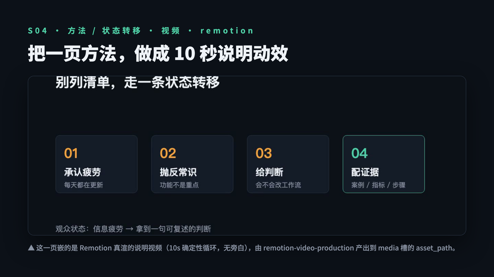

<sub>🌐 <b>中文</b> · <a href="README.en.md">English</a></sub>

<div align="center">

# Humanize PPT

> *「模板库能把一个概念铺成十几页好看的 HTML；可你要站着讲完的，是能推着观众一页页往前走的那条线。」*

[](SKILL.md)
[](https://skills.sh/LearnPrompt/humanize-ppt)
[](https://github.com/LearnPrompt/humanize-ppt/releases)
[](LICENSE)

**为演讲而生的 PPT 系统。** 好看的 HTML 模板满大街都是，缺的是把它讲出来的那条线。Humanize 干的是模板库不管的活：先用 AST（观众状态转移）把资料编成一条线，每翻一页都让观众多懂一点；该上画面的页，配真图、SVG 图表、Remotion 视频；渲染完它自己跑一遍演讲体检，把「只能看、不能讲」的页挑出来。最后给你的不是一摞静态页，是带演讲稿、知道状态怎么切、还留着 HTML 好看的演讲模式。整套 deck 还是下游模板库原生渲染——它把每页画好看，Humanize 让它能上台讲。

[30 秒装上](#30-秒装上) · [一句话用起来](#一句话用起来) · [看效果](#看效果) · [它解决什么](#它解决什么) · [演讲体检](#演讲体检把只能看不能讲的页揪出来) · [视觉增强](#视觉增强配图图表视频都是真产出) · [风格画廊](#风格画廊出大纲前先比-4-张封面) · [英文路径](#英文路径) · [AST 理论](docs/AST-theory.md)

</div>

---

## 30 秒装上

让你的 Agent（Codex / Claude Code / Hermes 等）装上 Humanize PPT —— 最简单的是直接把 GitHub 链接发给它：

```text
请安装 Humanize PPT Skill：https://github.com/LearnPrompt/humanize-ppt
```

或者用 npx 一行：

```bash
npx skills add LearnPrompt/humanize-ppt -g
```

Claude Code 用户也可以走 plugin marketplace（自动更新）：

```text
/plugin marketplace add LearnPrompt/humanize-ppt
/plugin install humanize-ppt
```

**跑通全流程，建议把这套下游 skill 一起装上**（Humanize 出大纲和决定，它们负责渲染和出素材）：

| Skill | 干什么 | 来源 |
|---|---|---|
| `guizang-ppt-skill` | 中文 deck 原生渲染（杂志风 / 瑞士风） | [op7418/guizang-ppt-skill](https://github.com/op7418/guizang-ppt-skill) |
| `frontend-slides` | 英文 deck 原生渲染（viewport-safe HTML） | [zarazhangrui/frontend-slides](https://github.com/zarazhangrui/frontend-slides) |
| `beautiful-html-templates` | 英文 deck 多模板渲染 | [zarazhangrui/beautiful-html-templates](https://github.com/zarazhangrui/beautiful-html-templates) |
| `remotion-video-production` | 逐页说明视频（真 mp4），统筹整个视频生产 | Remotion 系（见下方搭配） |
| `baoyu-image-gen` | 配图，走本地 Codex CLI（**无需 API key**） | [JimLiu/baoyu-skills](https://github.com/JimLiu/baoyu-skills/tree/main/skills/baoyu-image-gen) |

**Remotion 怎么搭配**（一点实战经验）：默认用 `remotion-video-production` 统筹流程，写代码时搭 `remotion-best-practices` 防不稳定写法（乱用 CSS / Tailwind animation、资源路径错误这类坑）；字幕、图表、3D、批量模板、自动渲染管线这种复杂工程再补 [`remotion-video-toolkit`](https://github.com/shreefentsar/remotion-video-toolkit)。

一句话给 Agent：「把 humanize-ppt 和它推荐的下游 skill（guizang-ppt-skill、frontend-slides、beautiful-html-templates、remotion-video-production + remotion-best-practices、baoyu-image-gen）都装上。」

## 一句话用起来

装好之后，一条话把全流程跑完，复制发给 Agent：

```text
用 humanize-ppt 把这份材料做成中文演讲 PPT：先出 AST 大纲和每页意图，
按大纲调 guizang-ppt-skill 原生渲染，配图用 baoyu-image-gen、视频用 remotion，
渲染完跑一遍演讲体检告诉我哪几页只能看不能讲，最后出演讲模式。
```

英文把「中文 + guizang-ppt-skill」换成「英文 + frontend-slides 或 beautiful-html-templates」即可。CLI 参数、分阶段控制、回灌命令这些都收在下方 [进阶用法](#进阶用法)，新手不用看。

## 看效果

### 风格画廊：出大纲前，下游真渲 4 张封面让你挑

<p align="center">
  
  
  
  
</p>

<p align="center"><sub>
▲ 同一份《AI 工具更新，不只是功能清单》的 4 张封面，guizang-ppt-skill 真渲——墨水经典 / 牛皮纸 / 靛蓝瓷（Style A）+ 瑞士克莱因蓝（Style B）。Humanize 出 spec/command，封面归下游渲。
</sub></p>

### 视觉增强：配图、视频都是真产出，会动

<p align="center">
  
  
</p>

<p align="center"><sub>
▲ 左：hero 配图，<code>baoyu-image-gen</code> 走本地 Codex CLI 真出图（gpt-image，无需 API key，仰拍人物叠在产品背景上）。右：逐页说明视频，真 Remotion 渲染的 mp4（这里转成 GIF 所以你能看到它动）。逐槽记录见 <a href="docs/showcase/v0.9-visual-enhancement/media-production-2026-06-17.md">产出记录</a>。
</sub></p>

<p align="center">
  
  
</p>

<p align="center"><sub>
▲ 放进 PPT 里长这样：配图作整页封面、大号非衬线标题压在上面（左）；说明视频嵌进内容页（右）。素材归下游产，Humanize 决定哪页要、放哪、配多大。
</sub></p>

### 演讲体检：把被遮挡的字自动揪出来

| 体检前：页码徽章吃掉正文 | 体检后：每个字都拿得出口 |
|---|---|
|  |  |

<p align="center"><sub>
▲ 真实案例（2026-06-13 英文 deck）：静态扫描通过，截图逐页复核发现页码徽章遮挡 9 页正文，观众看到的是「uires confirmation.」这样的断句。自动揪出来、出修复指令，复检通过——不用你再跟 Codex 一页页数。<a href="docs/showcase/hermes-agent-mastery/en/qa/presentation-checkup-2026-06-13.md">逐轮记录</a> · <a href="https://learnprompt.github.io/humanize-ppt/">在线翻完整 deck</a>
</sub></p>

### 演讲模式：渲染好的 deck 里按 <kbd>S</kbd> 切到演讲台

<p align="center">
  
  
</p>

<p align="center"><sub>
▲ 在渲染好的 deck 里按 <kbd>S</kbd> 切到演讲模式：左边当前页放大 + 计时器，右边是这一页的演讲稿和提词（cues）、下一页预览、整场页目录。中文走 guizang 瑞士风、英文走 Neo-Grid，都是下游原生产出——Humanize 出 <code>speaker_intent</code> 这个演讲稿语义源，下游照着搭这个台。
</sub></p>

## 它解决什么

我做过不少演讲。每次想用那些好看的 HTML PPT skill，都会撞到同一个问题：**它们更适合做概念展示**——一个简单概念也能给你铺成十几页，可一场一个半小时的演讲，撑死也就三十多页。好看的外壳跑在了内容密度前面，页是漂亮的，话是接不上的。

Humanize PPT 就是来补这个缺口的。它不抢模板库「渲染得好看」的活，它管的是把好看变成**能讲**：

1. **AST 大纲——每翻一页，观众多懂一点。** AST = Audience-State-Transfer（观众状态转移）。我把 70 多篇 TED 演讲喂给 AI，让它总结出观众是怎么被一页页带着走的。Humanize 用这套理论把资料编成一条线：每一页切过去，都该推动观众理解某个概念，而不是堆信息。
2. **视觉增强——该有画面的页，配上真东西。** 逐页决定要不要图、要不要 SVG 图表、要不要视频，写进计划交给下游：配图走 `baoyu-image-gen`（本地 Codex CLI，无需 key），视频走 Remotion，数据图表用确定性 SVG。中文（guizang）和英文路径都配齐了配图能力。
3. **自动演讲体检——别再人肉找翻车页。** 以前一页字被徽章盖住，我得跟 Codex 来回对话、让它顺着找第几页，很烦。不如渲染完 QA 一次性自动扫完，直接给出哪页、什么问题、怎么改。
4. **演讲模式——交付的是能上台的东西。** 有人感、有演讲稿、知道每页的状态切换，同时保留 HTML 那份好看。

边界很清楚：**最终好看的整套 deck，由下游模板库原生渲染**，Humanize 不抄它的模板、不在它渲染好的 HTML 上动手。Humanize 编排整场演讲，模板库画每一页。

## 演讲体检：把「只能看、不能讲」的页揪出来

先说清楚什么叫失败的页：一页只有几个字、没把意思说完；或者这页没完成它该完成的观众状态转移，听众看完状态没从 A 到 B。这样的页不该存在。HTML 的花样容易让人沉迷，做出一页里什么都没说的 deck——那只适合看，不适合讲。

体检对的不是美观，是大纲：拿渲染结果逐页跟大纲核差异。失败模式目录在 [references/qa-failure-modes.md](references/qa-failure-modes.md)（[English](references/qa-failure-modes.en.md)），每条都写了「观众视角会看到什么」。静态扫描盖不到的（文字溢出、徽章遮挡、WebGL 封面静态截图捕获不到等），目录里如实标了「测不出的失败类」，靠截图复核兜底——宁空不摆拍。

## 视觉增强：配图、图表、视频都是真产出

Humanize 逐页决定要不要图 / SVG 图表 / 视频，写进 `slide_plan.json` 的 `media` 槽（带 `asset_path` + `prompt_hint`），下游照着把真实文件产到那个路径。配图用什么生成器是热插拔的，推荐：

- **配图**：`baoyu-image-gen` 走**本地 Codex CLI**（`--provider codex-cli`，用已登录的 ChatGPT 订阅，**不用 OPENAI_API_KEY**）。氛围 / 概念 / hero 图用它出，又好看又省 key；数据、指标、流程这类带精确文字数字的图留确定性 SVG（图像模型会糊字）。
- **视频**：Remotion 渲染 `duration_s` 秒的确定性循环（无旁白）。
- **图表**：确定性内联 SVG / HTML，零依赖零外呼。

v0.9 实测把一份 deck 的 8 个媒体槽逐个填成真资产（[产出记录](docs/showcase/v0.9-visual-enhancement/media-production-2026-06-17.md)）：codex 真出 hero 图 + 2 支真 Remotion mp4 + 真截图 + 确定性 SVG，证明媒体槽是真任务、各类生成器都接得上。

## 风格画廊：出大纲前，先比 4 张封面

别让人盲选风格。`--style-gallery` 在出大纲前停下，为渲染器出 ≥4 个封面候选，每个候选写一条「只渲封面」命令交给下游真渲，再拼一页零依赖的 `style_gallery.html` 把封面并排供选。挑中哪张，回灌它的命令把风格带进正常的大纲 → brief 流程。封面由下游真渲，Humanize 只出 spec/command。规格见 [references/style-gallery-spec.md](references/style-gallery-spec.md)。

## 演讲大纲预览：渲染之前，先看一眼观众状态弧

v0.7 起 Humanize 有了自己的可截图工作底稿（不是 deck）：观众状态转移图。输入 `slide_plan.json`，输出一页零依赖 HTML——每页一行「页号 → 观众进入状态 → 本页意图 → 离开状态」，顶部一条状态弧。渲染之前 5 分钟看穿哪页在原地踏步。

<p align="center">
  
</p>

## 演讲模式

收尾交付的是能上台的演讲，不是一摞静态页：有逐页演讲稿、知道状态切换、保留 HTML 的好看。**这一步由下游 skill 原生产出**——Humanize 出 `speaker_intent.md`（演讲稿的语义源）并在 brief 里指挥下游搭 presenter shell / speaker notes / 部署。Humanize owns「每页该讲什么」，模板库 owns「presenter 怎么渲」。

## 进阶用法

<details>
<summary><b>CLI 参数、分阶段控制、风格选择、fix prompt 细节</b>（新手可全部跳过）</summary>

### Brief 模式（默认）

```bash
python3 scripts/humanize_ppt.py \
  --source examples/01-ai-tool-update/source.md \
  --out .humanize-ppt-runs/ai-tool-update \
  --title "AI 工具更新，不只是功能清单" \
  --renderer guizang --guizang-style A --guizang-theme ink-classic
```

得到 `guizang-production-prompt.md`，交给 `guizang-ppt-skill` 原生渲染。英文路线把 `--renderer` 换成 `frontend-slides` 或 `beautiful-html-templates`。

### 风格画廊（出大纲前的封面选择门）

```bash
python3 scripts/humanize_ppt.py --source examples/01-ai-tool-update/source.md \
  --out .humanize-ppt-runs/ai-tool-update --title "AI 工具更新，不只是功能清单" \
  --renderer guizang --style-gallery
```

得到 `style_gallery.html`（封面选择器）+ `style_gallery_plan.json` + 每候选一条「只渲封面」命令。`--gallery-count` 默认 4、最小 4。

### 演讲体检（拿到渲染产物后）

```bash
python3 scripts/humanize_ppt.py --qa-from <rendered.html> \
  --out <之前的 out 目录> --renderer guizang --guizang-style A --max-qa-iterations 3
```

得到 `qa_report.md` / `fix_prompt.md` / `qa_iteration.json`，3 轮封顶，不收敛标 `needs-human`。`fix_prompt.md` 是给下游 skill 的修复指令，转给它重渲，不要在 Humanize 里后处理 HTML。

### 配图 / 视频 / 大纲预览

```bash
# 配图：本地 Codex CLI，无需 key
bun ~/.agents/skills/baoyu-image-gen/scripts/main.ts \
  --prompt "..." --image assets/s01-image.png --provider codex-cli --ar 16:9

# 大纲预览（观众状态转移图）
python3 scripts/preview_outline_html.py \
  --slide-plan <out>/slide_plan.json --out <out>/preview-outline.html --title "标题"

# 演示 GIF（把工作底稿录成动图）
python3 scripts/record_demo_gif.py --source examples/01-ai-tool-update/source.md \
  --title "标题" --out docs/showcase/demo.gif --covers-dir <真渲封面目录>
```

</details>

## 触发方式

- 「用 humanize-ppt 把这份资料做成演讲 PPT」
- 「先出 AST 大纲和逐页素材决定，再调 guizang 渲染」
- 「帮我盯一下渲染出来的 PPT 有没有翻车 / 给这份 deck 做演讲体检」
- 「告诉我哪几页只能看不能讲」「这页 Hero 背景看不见，出修复指令」
- 「把这份老 PPT 重新编排成人愿意听的结构」

只想要一页漂亮模板、不需要大纲和体检时，直接用渲染类 skill 即可。要的是「观众听完状态有变化、每页都拿得出口去讲」时，再加上 Humanize。

## 能力

- **AST 大纲**：把资料转成观众、状态转移、页面意图和讲述节奏，每翻一页推动理解。
- **视觉增强**：逐页决定图 / SVG / 视频，下游用 baoyu-image-gen（配图）/ Remotion（视频）/ 确定性 SVG（图表）真产出。
- **风格画廊**：出大纲前出 ≥4 个封面候选，下游各渲一张，零依赖选择器供挑。
- **演讲大纲预览**：从 `slide_plan.json` 生成观众状态转移图，渲染前先看状态弧。
- **演讲体检**：渲染后逐页核对大纲差异，扫失败模式，写 fix prompt 给下游重渲，3 轮封顶。
- **演讲模式**：演讲稿语义源 + brief 指挥下游产 presenter / 部署。

## 它和同类有什么不同

| | 直接用模板库 Skill | **Humanize PPT** |
|---|---|---|
| 起点 | 资料直接进模板 | 先问观众是谁、看完要变成什么状态（AST） |
| 密度 | 一个概念铺成十几页好看的页 | 编成一条能讲的线，每页推动状态转移 |
| 素材 | 模板自带什么用什么 | 逐页决定要不要图/SVG/视频，写进计划交下游产 |
| 渲染 | 自己渲染 | 交给下游模板库原生渲染，零模仿 |
| 质量 | 渲染完即交付 | 自动演讲体检逐页核对，3 轮，写 fix prompt |

一句话：模板库负责「渲染得好看」，Humanize 负责「能讲、有人盯、能上台」。它们是上下游，不是竞品。

## 英文路径

Humanize 的 brief 是普通 markdown + JSON，谁都能读，所以它**广义兼容任何能产出 HTML PPT 的下游 skill**。中文、英文两条路我们都真实跑通过演讲体检：

| 渲染器 | 状态 | 已验证的 |
|---|---|---|
| `guizang-ppt-skill`（中文） | 全链路 | brief + 演讲体检都在真实渲染产物上验证过；失败模式目录有 7 条 guizang 专属规则 |
| `beautiful-html-templates`（英文） | 全链路 | brief 出口 + 2026-06-13 在真实 Neo-Grid deck 上跑完演讲体检（发现页码徽章遮挡 9 页 → 修复 → 复检通过，[记录](docs/showcase/hermes-agent-mastery/en/qa/presentation-checkup-2026-06-13.md)） |
| `frontend-slides`（英文） | 全链路 | brief 出口 + 2026-06-17 在真实 5 页 deck 上跑完演讲体检（扫描 pass + 负向对照证伪 + 截图复核，[记录](docs/showcase/v0.9-frontend-slides/qa/presentation-checkup-2026-06-17.md)） |

英文和中文是同一档：brief 出口可用 + 演讲体检在真实产物上验证过 + 配图能力配齐。三者的差别只在「渲染器专属失败模式规则数」——guizang 沉淀了 7 条 Style A/B 专属规则，英文两条目前靠渲染器无关层的规则（占位残留等）+ 截图复核，专属规则还在按真实产物慢慢沉淀。这不是承诺表，是实测表：每一格背后都有真实渲染产物，对应 `registry/renderer_registry.json` 的 `support_level`。

## 为什么是 AST

- **Audience**：观众是谁，知道什么，抗拒什么。
- **State**：看之前什么状态，看完该变成什么状态。
- **Transfer**：每一页如何推动这次状态转移。

> PPT 不只是信息容器，而是观众状态改变器。

详见 [AST 理论](docs/AST-theory.md)、[SPEC.md](SPEC.md)（引擎技术规格）、[v0.9 版本说明](docs/versions/v0.9.0-style-gallery.md)。

## 安全边界

- 不抄、不 post-process 下游 Skill 渲染好的 HTML，渲染问题永远写成 fix prompt 交回下游改；
- 全流程本地脚本，零 API、零 Key（配图走本地 Codex CLI 订阅），不外发任何资料内容；
- 演讲体检 3 轮不收敛即停手标 `needs-human`，不无限重试；
- 不把私有路径、账号、凭据写进 brief 和示例。

## Reference

- [SPEC.md](SPEC.md)、[v0.9 版本说明](docs/versions/v0.9.0-style-gallery.md)、[风格画廊规约](references/style-gallery-spec.md)、[演讲体检失败模式](references/qa-failure-modes.md)（[en](references/qa-failure-modes.en.md)）、[brief 规约](references/guizang-production-brief-orchestrator.md)、[AST 理论](docs/AST-theory.md)、[OPC 工作流](docs/OPC-workflow.md)。
- 下游：[guizang-ppt-skill](https://github.com/op7418/guizang-ppt-skill)、[frontend-slides](https://github.com/zarazhangrui/frontend-slides)、[beautiful-html-templates](https://github.com/zarazhangrui/beautiful-html-templates)、[baoyu-image-gen](https://github.com/JimLiu/baoyu-skills/tree/main/skills/baoyu-image-gen)。

## License

MIT

---

<div align="center">

**[LearnPrompt](https://github.com/LearnPrompt) 出品** · 同门手艺

[鲁班·Skill打磨](https://github.com/LearnPrompt/luban-skill) · [庖丁·博主蒸馏](https://github.com/LearnPrompt/paoding-skill) · [蔡伦·对话造纸](https://github.com/LearnPrompt/cailun-skill) · [阿福·LLM Todo](https://github.com/LearnPrompt/afu-llm-todo) · [AI雷达·零API资讯](https://github.com/LearnPrompt/ai-news-radar) · [淘金小镇·ClawHub日榜](https://github.com/LearnPrompt/skillrush-town) · [Irasutoya·正文配图](https://github.com/LearnPrompt/carl-irasutoya-illustrations) · [Humanize PPT·演讲系统](https://github.com/LearnPrompt/humanize-ppt) · [CC Harness·六件套](https://github.com/LearnPrompt/cc-harness-skills)

<sub>公众号「卡尔的AI沃茨」 · [X @aiwarts](https://x.com/aiwarts) · [learnprompt.pro](https://www.learnprompt.pro)</sub>

</div>
